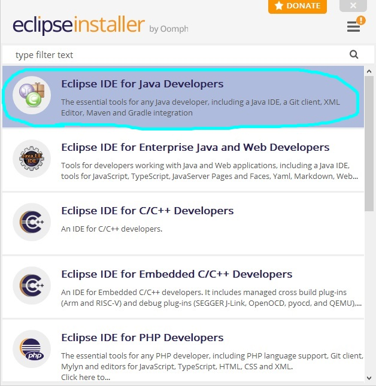
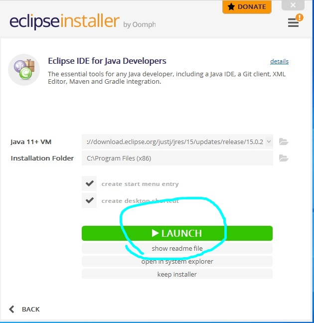
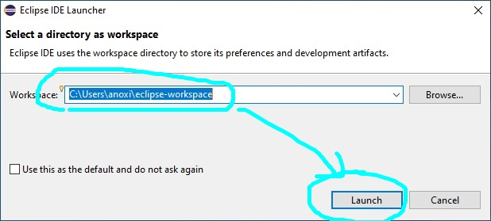

# How to install Java and Eclipse

## How to install Java

* Go to [**java.com**](https://www.java.com/en/download/).
* Click **"Agree and Start Free Download"**:

* Save file in prefferred location:

* Run the **.exe** file (double click on it) and click **"Yes"**.
* Tick the **"Change destination folder"** box, click **"Install"**:

* Wait for the installation:

* You have successfully installed Java should display after install. Click **"Close"**:

 	
To check installation, open **Command Prompt**:

*Type **"java -version"** and press **"Enter"**:

* The current version should be displayed.

## How to install Eclipse

To run Java, you need an [**IDE**](https://www.codecademy.com/articles/what-is-an-ide), we reccommend **Eclipse**.

* Go to [**eclipse.org/downloads**](https://www.eclipse.org/downloads/).
* Click **"Download"**:

* Select Get Eclipse IDE 2021-03 and click **"Download x86_64"**:

* Save file to preferred location:

	
* Run the **.exe** file (double click on it) - **eclipseinstaller** should display:

* Select **"Eclipse IDE for Java Developers"**:

* Choose your destination folder and click **"Install"**:

* Click **"Accept now"** on the **User Agreement**:

* Wait for installation and click **"Launch"**:

* Choose your destination folder for Eclipse workspace (this will store all your Java projects) and click **"Launch"**:

* Eclipse Welcome screen should be displayed:

## How to run a project via Eclipse

* Select **"File > New>Java Project"**:

[pic]

* Enter the new project name (we suggest **"L2-Capstone1"**) and click **Finish**:

[pic]

* Select small **"J"** icon to the right and close **welcome** tab:

[pic]

* You should see the created folder in the **Package Explorer**.
* Navigate to **"src"**:

[pic]
	
* Copy the three **.jav** files from where you saved them into **"src"**:

[pic]

* Double click on a file to open it in the compiler:

[pic]

* To run them, select **"Run"** tab and click **"Run"**:

[pic]

* You should now see the program running in the Eclipse Console:

[pic]

And that's it! You're all set up!
