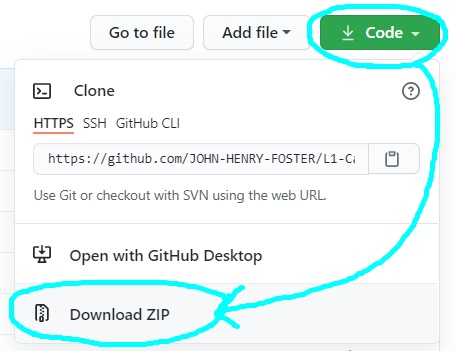

# L2-Capstone1    

    	 

This project is a project management application designed for a small engirneering firm to keep track of their projects and the people involved in them.  It aims to provide a more effective way of securely storing, accessing, and changing vital project and personal information, and could be adapted for any organization with similar needs.

## How does it work?

### Users can:
* Create new projects and capture all neccessary to store project and personal info 
* Update information about existing projects
* Finalize projects and generate invoices
* View incomplete or past-due projects
* Find and view individual projects and people

## Who can use it? 

Anyone  can use this free, open source software, although it was desinged for:
* Organizations or individuals who wish to have a more efficient record keeping system for medium to large scale projects.
* This includes businesses specializing in skilled labor, construction, maintainance, renovation, installation of security systems, landscaping, and agricultutral projects.
* Engineering and architecture firms.
* Property development firms.
* Beginner developers looking for something relatively simple to work with.
* Developers of similar systems looking for components.

We also welcome everyone who would like to continue improving this program!

## To run or edit this program:

* You need Java and an [**IDE**](https://www.codecademy.com/articles/what-is-an-ide).
* If you don't have Java, go [**here**](JAVAINSTALL.md#how-to-install-java-and-eclipse).
* If you don't have an IDE - we reccommend Eclipe. Go [**here**](JAVAINSTALL.md#how-to-install-eclipse).
* Else, simply click "Code" and "Download ZIP". 

  
* Unzip the folder in your preferred location.
* Run or edit the file using [**these**](JAVAINSTALL.md#how-to-run-a-project-via-eclipse) steps.

## How you can help

* **Contact us** if you have any suggestions/questions.
* Write up any issues [**here**](https://github.com/JOHN-HENRY-FOSTER/L2-Capstone1/issues).
* Read our [**Contribution Guide**](CONTRIBUTING.md#contributing) which contains everything you need to know about helping to improve the project. 
* We explicity welcome non-developer input.

## Licence

This project has been licenced under [**GPLv3**](https://www.gnu.org/licenses/gpl-3.0.html).  

It is [free](https://www.gnu.org/philosophy/free-sw.html), [open source](https://opensource.org/osd), [copyleft](https://www.gnu.org/licenses/copyleft.en.html) software: 
Anyone can use, edit, and redistribute it in any way they see fit, but it must be redistributed under the same licence, and certain restrictions apply.

For more information, please see [**Licence**](LICENCE.md#licence).

## Contact us

The fastest way to get hold of us is always via [email](mailto:anoxicdrollie@gmail.com).

Shoot us a mail, and we'll get back to you as soon as time allows - we would love to hear from you!
